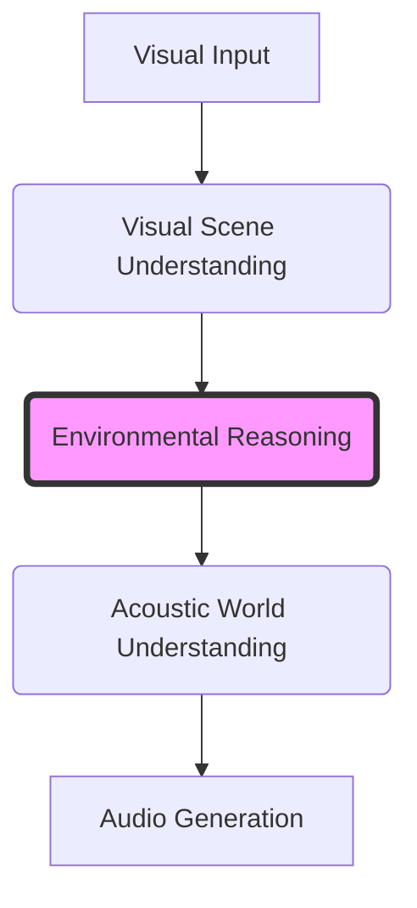

# Environmental Audio Reasoning (EAR) Research Handbook


## 1. Project Theme and Vision

The core scientific question driving this project is:
> **Can an AI system understand the physical context of a visual scene well enough to infer what the environment would realistically sound like?**

This is **not** an image-to-audio translation task. Rather, it is an **environmental reasoning task**. Audio generation is merely the final, downstream modality used to validate and output the results of physical scene reasoning.



When humans view a sunset beach scene, we do not just see colors and shapes; we infer the sound of waves crashing, the rustle of dry palm leaves, wind passing through the air, and footsteps shifting sand. This project aims to replicate that physical common sense and acoustic reasoning in an AI system.

---

## 2. Repository Structure

This handbook is organized into three major sections:
1.  **Strategic and Project Documents (`docs/`)**: Defining project principles, vision, scientific problem definitions, and publication roadmap.
2.  **Domain Knowledge Base (`knowledge/`)**: Educational summaries of existing work in related sub-fields (Computer Vision, Spatial Audio, Multimodal AI, Psychoacoustics, etc.) to establish a common scientific language.
3.  **Resource Directories**: Placeholders for datasets, academic papers, active experiments, and meeting notes.

```
Research-Handbook/
├── README.md                           # This entrypoint document
├── docs/                               # Strategic & project design documents
│   ├── 00_Project_Overview.md          # Synthesized overview of the research program
│   ├── 01_Project_Vision.md            # Vision, real-world examples, and workflows
│   ├── 02_Motivation.md                # Applications and limitations of existing models
│   ├── 03_Research_Problem.md          # Scientific definitions, scope, and assumptions
│   ├── 04_Project_Principles.md        # Technical and methodology guidance
│   ├── 05_Current_Project_Status.md    # Confirmed decisions vs. open research areas
│   ├── 06_Research_Roadmap.md          # Research timeline and tasks (placeholder)
│   ├── 07_Potential_Publications.md    # Target papers and academic dissemination plan
│   ├── 08_Glossary.md                  # Standardized terminology definitions
│   └── 09_FAQ.md                       # Frequently Asked Questions
├── knowledge/                          # Educational textbooks on relevant fields
│   ├── Computer_Vision.md              # Object detection, segmentation, optical flow
│   ├── Audio_Generation.md             # Waveforms, spectrograms, generation models
│   ├── Scene_Understanding.md          # Semantic layouts, materials, and physics
│   ├── Environmental_Audio.md          # Continuous vs. discrete soundscapes
│   ├── Multimodal_AI.md                # CLIP, ImageBind, CLAP, and alignment
│   ├── Spatial_Audio.md                # Binaural acoustics, HRTF, propagation
│   ├── Scene_Graphs.md                 # Relationship modeling for acoustic context
│   ├── Common_Sense_Reasoning.md       # Physical commonsense and sound source mapping
│   └── Psychoacoustics.md              # Human auditory perception and masking
├── datasets/                           # Data structure specifications and guidelines
├── papers/                             # Literature tracking and review notes
├── experiments/                        # Experiment tracking and logging guidelines
├── ideas/                              # Unstructured brainstorms and hypotheses
├── meetings/                           # Shared notes and historical decisions
└── references/                         # External literature links and onboarding guides
    ├── Reading_List.md                 # Primary reading assignments
    ├── Project_Timeline.md             # High-level chronological milestones
    └── Contribution_Guide.md           # Onboarding checklist and technical guidelines
```

---

## 3. How to Begin Reading

If you are a new researcher joining this project, we recommend reading the handbook in the following sequence:
1.  **Core Project Alignment**:
    *   Read [00_Project_Overview.md](docs/00_Project_Overview.md) to understand the high-level scope.
    *   Read [01_Project_Vision.md](docs/01_Project_Vision.md) and [02_Motivation.md](docs/02_Motivation.md) to align on *why* this research matters.
    *   Study [03_Research_Problem.md](docs/03_Research_Problem.md) to see exactly what we are trying to solve and what we are explicitly ignoring.
2.  **Scientific Foundations**:
    *   Consult [08_Glossary.md](docs/08_Glossary.md) for standard terms.
    *   Go through the [knowledge/](knowledge/) directory. Focus on areas where you do not have a strong background (e.g., if you are an audio generation expert, read [Scene_Understanding.md](knowledge/Scene_Understanding.md) and [Common_Sense_Reasoning.md](knowledge/Common_Sense_Reasoning.md)).
3.  **Onboarding & Contribution**:
    *   Review [04_Project_Principles.md](docs/04_Project_Principles.md) to understand our scientific criteria.
    *   Consult the [Contribution Guide](references/Contribution_Guide.md) and start the [Reading List](references/Reading_List.md).

---

## Open Questions

*   How often should the handbook be updated during the initial literature review phase?
*   Should external advisory boards or community feedback be factored into the project vision early on?

## Future Work

*   Complete the preliminary literature reviews outlined in the [references/Reading_List.md](references/Reading_List.md).
*   Formulate a concrete roadmap after the initial literature review is finished.

## Related Documents

*   [Project Overview](docs/00_Project_Overview.md)
*   [Project Vision](docs/01_Project_Vision.md)
*   [Contribution Guide](references/Contribution_Guide.md)
