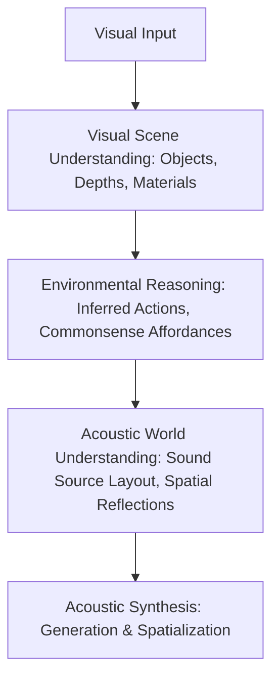

# Project Vision: Environmental Audio Reasoning (EAR)

## 1. Defining the Vision

The ultimate goal of this research project is to build an artificial intelligence system capable of looking at a visual environment and inferring its natural soundscape by reasoning about the physical, temporal, and spatial relationships within that scene.

This stands in stark contrast to existing visual-to-audio models, which primarily learn statistical associations between visual features (e.g., color histograms, CNN textures) and audio waveforms. Such systems perform translation, not reasoning.

### The Human Reference Point
Humans possess a rich model of the physical world. When shown a single photograph, we do not just recognize objects; we simulate the environment. For example:

*   **Scene**: A solitary hiker walking on a pebble beach at sunset.
*   **Visual Data**: Static pixels representing water, sky, pebbles, a person, and dynamic elements implied by posture/water crests.
*   **Human Acoustic Inferences**:
    *   *Periodic low-frequency sounds*: Waves breaking on the shoreline, modulated by the slope of the beach.
    *   *Continuous mid-to-high frequency noise*: Wind moving across open space, rustling coastal grass.
    *   *Discrete impulse events*: Footsteps crushing pebbles, occurring at a cadence matched to walking posture.
    *   *Ambient sound field*: Distant bird calls (gulls) whose volume suggests distance, and a general lack of urban industrial hum.

This reasoning draws upon:
1.  **Material Physics**: How leather boots interact with loose pebbles vs. wet sand.
2.  **Atmospheric Dynamics**: The correlation between sunset lighting, clouds, and wind speed.
3.  **Spatial Layout**: Sound propagation over open water vs. inside a dense forest.
4.  **Acoustic Commonsense**: Knowing that gulls are common near beaches, while wolves are not.

## 2. Conceptual Pipeline

The project rejects the direct $Image \rightarrow Audio$ model, preferring a structured pipeline:

Under this vision, the **Audio Synthesis** stage is modular and exchangeable. The core scientific contribution of this project is the **Environmental Reasoning** and **Acoustic World Understanding** stages.

---

## Open Questions

*   How can we model dynamic events (e.g., footsteps, wind gusts) from a static image without temporal sequences (video)?
*   To what extent should the model simulate physical sound propagation (wave equations) vs. learning statistical approximations of space?

## Related Documents

*   [Motivation](02_Motivation.md)
*   [Research Problem](03_Research_Problem.md)
*   [Project Principles](04_Project_Principles.md)
