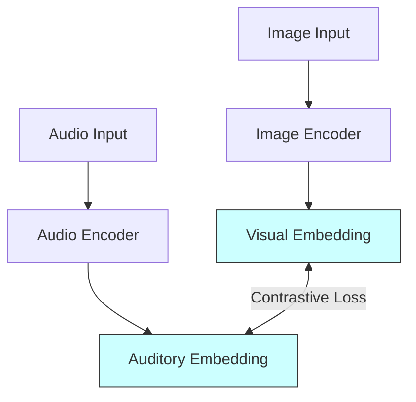

# Current Project Status


## 1. Decided Aspects

The following parameters are established and serve as the foundation of the project:

1.  **Project Theme**: Visual Scene Understanding for Environmental Audio Reasoning (EAR).
2.  **Core Methodology**: Prioritizing environmental, spatial, and physical reasoning over simple translation. The project will focus on building intermediate representations rather than direct pixel-to-waveform architectures.
3.  **Modularity**: Decoupling visual analysis, reasoning, and audio synthesis to allow component-level testing.

---

## 2. Intentionally Undecided Aspects

The following areas are open for research and will be defined after literature reviews:

*   **Model Architecture**: The specific neural architecture for reasoning (e.g., scene-graph transformers, physical simulators, vector alignment networks) is undecided.
*   **Dataset Selection**: We have not finalized which datasets (e.g., VGGSound, AudioSet, Foley-focused datasets) we will use for training and benchmarking.
*   **Training Protocol**: The balance between self-supervised, supervised, and reinforcement learning strategies remains open.
*   **Evaluation Protocol**: The metrics for evaluating "reasoning" (as opposed to raw generation quality) are yet to be determined.

---

## 3. Potential Directions Under Investigation

### Aligning Cross-Modal Vector Spaces
One promising direction is using joint embedding spaces (e.g., CLIP, CLAP, ImageBind) to align visual and auditory semantics. 

By projecting images and audio into a shared latent space, we can bring similar visual scenes and soundscapes together. This enables:
*   Retrieval of candidate sounds based on visual context.
*   Zero-shot matching of visual regions to audio clips.
*   Regularization of intermediate reasoning states.



---

## 4. Expected Milestones

The project is structured around four initial phases:

```
[Phase 1: Literature Review] ──> [Phase 2: Dataset & Baseline] ──> [Phase 3: Architecture Design] ──> [Phase 4: Evaluation]
```

1.  **Phase 1: Literature Review & Reading List completion** (Target: Month 1-2)
2.  **Phase 2: Dataset collection and baseline formulation** (Target: Month 3-4)
3.  **Phase 3: Architectural proposal for the reasoning module** (Target: Month 5-6)
4.  **Phase 4: Baseline execution and initial evaluation** (Target: Month 7-8)

---

## Open Questions

*   Can off-the-shelf multimodal embedding models (e.g., ImageBind) capture fine-grained acoustic properties like material dampening, or do we need to train custom encoders?
*   Should our benchmark prioritize outdoor or indoor environments?

## Future Work

*   Synthesize the findings of the initial literature review into the [knowledge/](../knowledge/) files.
*   Draft the project timeline in [Project_Timeline.md](../references/Project_Timeline.md).

## Related Documents

*   [Project Overview](00_Project_Overview.md)
*   [Research Problem](03_Research_Problem.md)
*   [Project Principles](04_Project_Principles.md)
*   [Reading List](../references/Reading_List.md)
